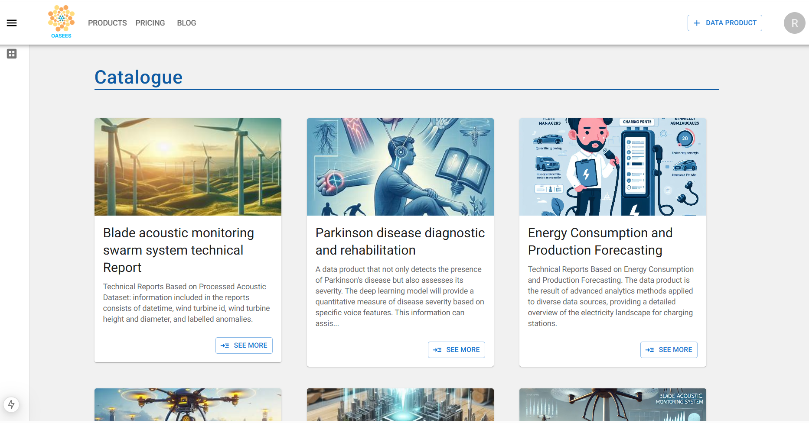
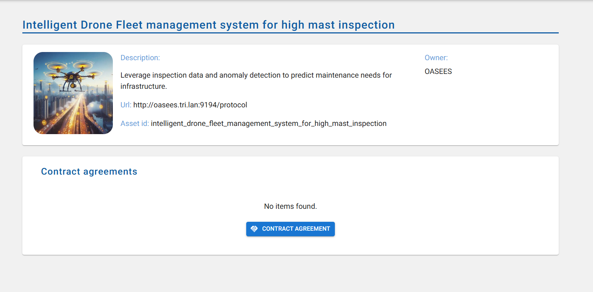
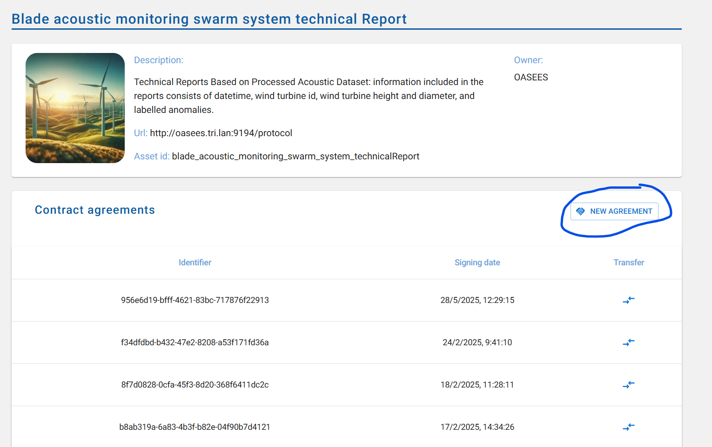
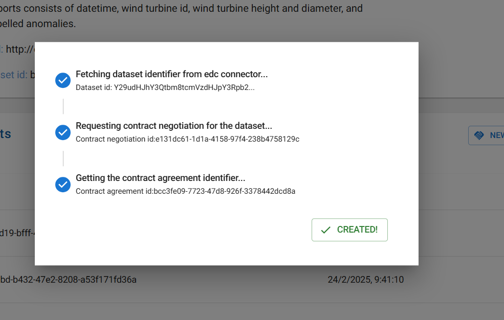
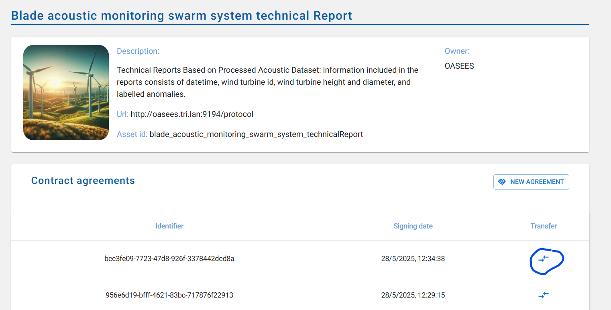
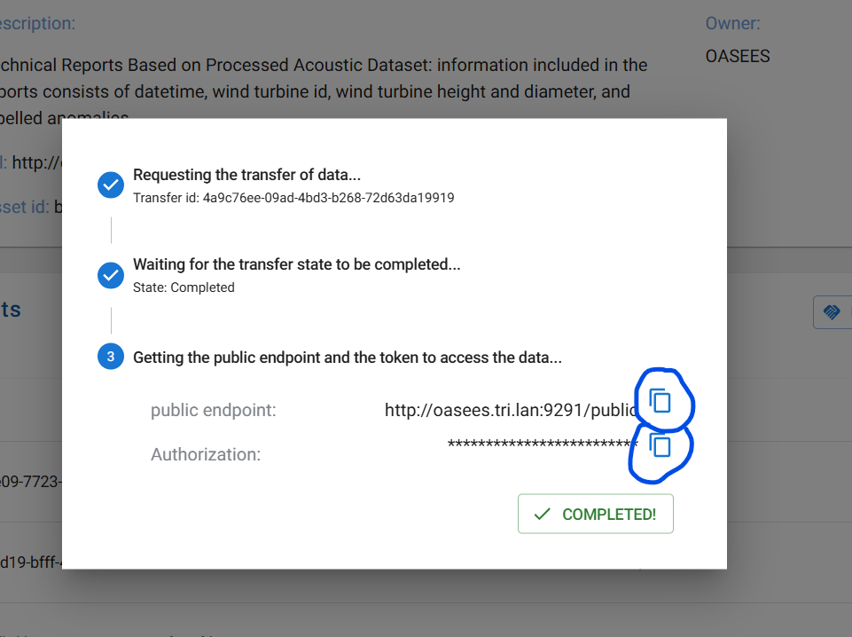
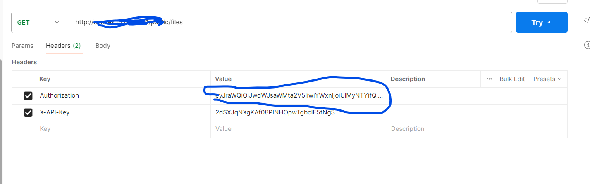
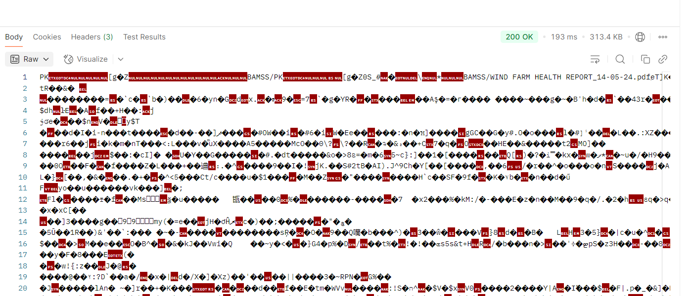
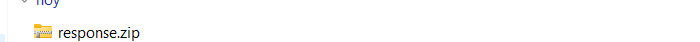
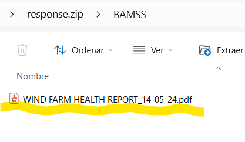

# Oasees Dataproduct catalogue

This is a front end of data products stored into EDC Connector ready to be consumed


## How to use

1.- Download the example [or clone the repo](https://github.com/mui/material-ui):

<!-- #default-branch-switch -->

```
https://github.com/oasees/Data-Federation.git
cd Catalogue
```

2.- .env file

Modify this values:
````commandline
CONSUMER_URL=DNS or IP of consumer EDC connector (withoout http:// or https://)
PROVIDER_URL=DNS or IP of provider EDC connector (withoout http:// or https://)
PROVIDER_ASSIGNER=same value as edc.participant.id
````

3.-Install it and run:

```
docker compose up 

```
Open [http://localhost:3000](http://localhost:3000) with your browser to see the result.

 

Choose one of the products you wish to consume and click "See More." The following window will appear:

If the data product has no contracts, the following window will be displayed:



And if it already has pre-established contracts, they will appear in the list. Whether there are contracts or not, a new one can always be created by clicking the "New agreement" button.


The following window will appear, and once the agreement is finalized, you must click the "Created" button, after which the created contract will appear in the contract list.




f you want to consume, you need to click the button below the "Transfer" column.



The following window will appear with the corresponding steps of the transfer, after which we only need to copy the values of the public endpoint and the Authorization token. Use
curl or a program similar to Postman to complete the data consumption step.





Save response to a file:


Open file:



Unzip the ZIP file, and the document will appear:



