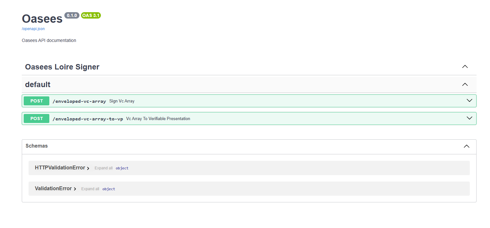
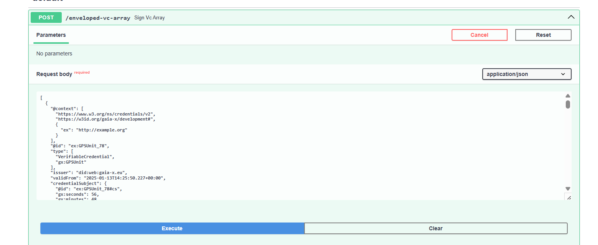
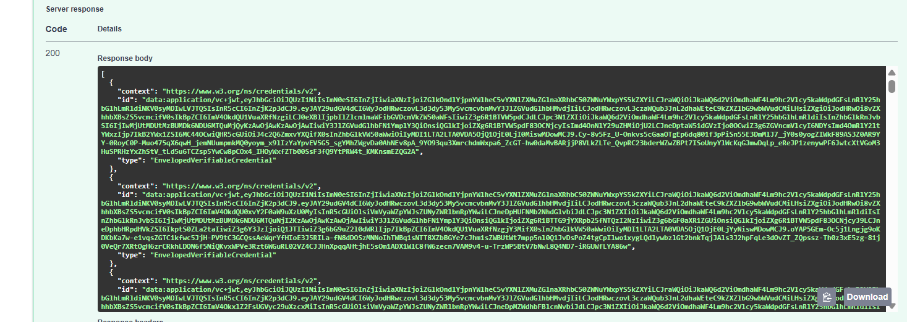
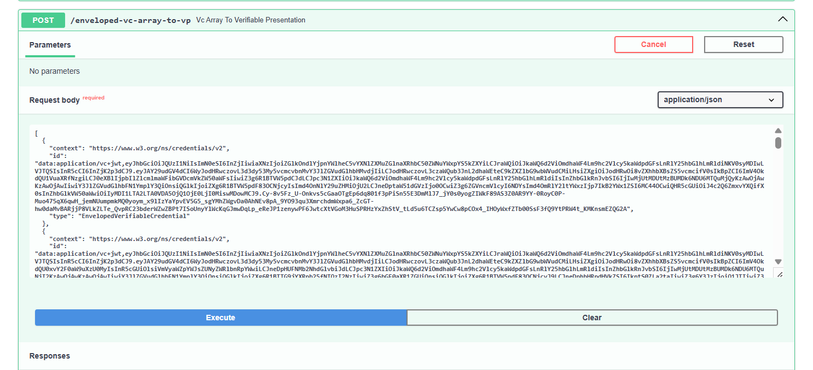
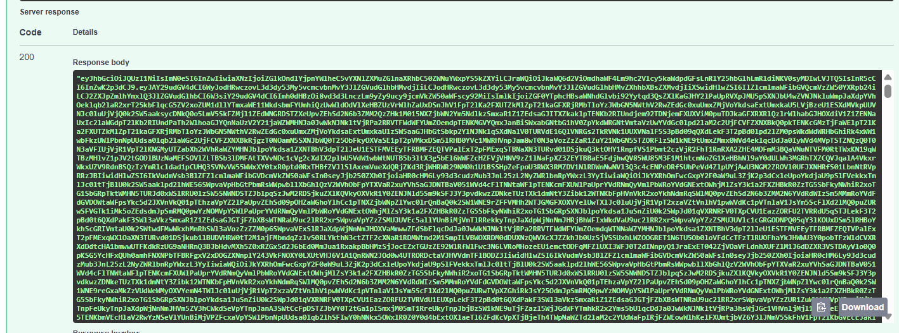

# Oasees Loire Signer

This is a signer for Loire verifiable credentials
An utility application for verifiable credentials, built to sign VC-JWTs.
## How to use

1.- Download the repo


```
https://github.com/oasees/Data-Federation.git
cd Loire_signer
```

2.- .env file

Modify this values:
````commandline
DOMAIN= domain for the did, it is mandatory 
PRIVATE_KEY_FILE_NAME=Name of the file of private key
PRIVATE_KEY_ALGORITHM=private key algorith like "RS256"
JWKS_KEY_NAME=Verification method for the signer like "#JWK2020-RSA"
EXPIRES=False if credential doesn't expire and True if expires
DAYS_EXPIRES=number of days for credential validation, integer value

````

3.-Install it and run:

```
docker compose up 

```
Open [http://localhost:9103](http://localhost:3000) with your browser to access to swagger REST Endpoints.

 

It has two endpoints, and both must be executed.

The first endpoint will take the array of credentials and sign them, producing a result similar to:
Input:

Output:


The second endpoint will take the output of the first endpoint and sign it again, generating a single JWT token ready for the compliance phase.
Input:

Output:
